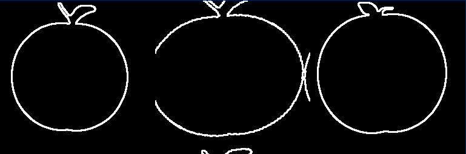
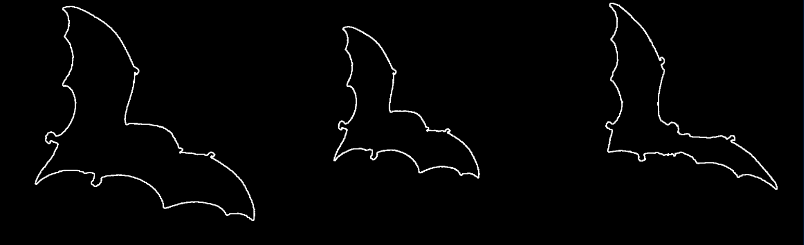
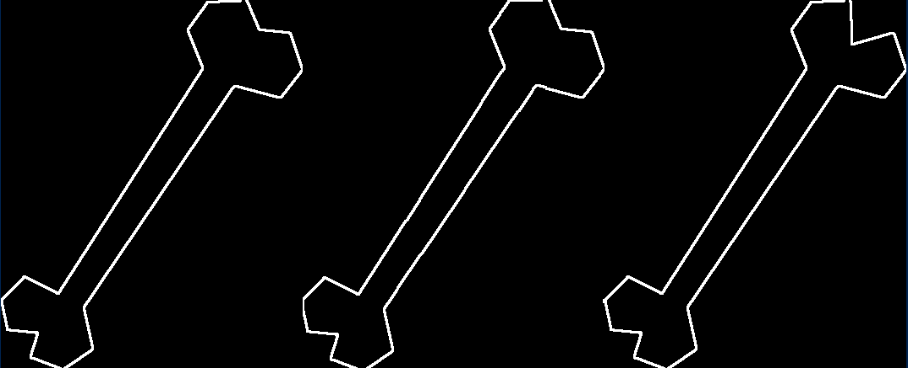

# Shape-Alignment
a function that aligns two sets of points using global image transformation (similarity, affine, or perspective) and returns $T$  where T is a transformation that maps non-zero points in im1 to non-zero points in im2.

## Overview
In this problem, you will write a function that aligns two sets of points using global image transformation (similarity, affine, or perspective) and returns $T$  where $T$ is a transformation that maps non-zero points in $im1$ to non-zero points in $im2$. You may choose the alignment algorithm and the type of (global) transformation (e.g., rigid Euclidean, affine, perspective).


Test your code on the 25 image pairs provided in the supplementary material. We have included functions 
**(will check) evalAlignmentAll and displayAlignment to help with evaluation and display**.

# Usage
```
Run the ShapeAlignment.ipynb file
```

# Results

<table>
    <tr>
        <td></td>
    </tr>
        <tr>
        <td></td>
    </tr>
        <tr>
        <td></td>
    </tr>
</table>

## Folder Structure
```
📦Shape-Alignment
 ┣ 📂Results
 ┃ ┣ 📜im1.png
 ┃ ┣ 📜im2.png
 ┃ ┗ 📜im3.png
 ┣ 📜.gitignore
 ┣ 📜LICENSE
 ┣ 📜README.md
 ┗ 📜Shape_Alignment.ipynb
```